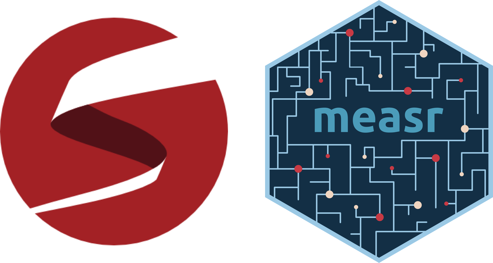

# Welcome!

```{r}
#| label: setup
#| include: false

library(knitr)
```

## Who am I?

:::{.columns}
:::{.column width="50%"}
<br>W. Jake Thompson, Ph.D.

* Assistant Director of Psychometrics
  * [ATLAS](https://atlas.ku.edu) | University of Kansas

* Research: Applications of diagnostic psychometric models
  * Lead psychometrician and Co-PI for the [Dynamic Learnings Maps](https://dynamiclearningmaps.org) assessments
  * PI for an [IES-funded](https://ies.ed.gov/funding/grantsearch/details.asp?ID=4546) project to develop software for diagnostic models
:::

:::{.column width="50%"}
:::{.center}


:::{.small}
 &nbsp; [\@](https://www.gitub.com/)  
 &nbsp; [\@](https://bsky.app/profile/)
:::
:::
:::
:::

## Acknowledgements

The research reported here was supported by the Institute of Education Sciences, U.S. Department of Education, through Grants [R305D210045](https://ies.ed.gov/funding/grantsearch/details.asp?ID=4546) and [R305D240032](https://ies.ed.gov/funding/grantsearch/details.asp?ID=6075) to the University of Kansas Center for Research, Inc., ATLAS. The opinions expressed are those of the authors and do not represent the views of the the Institute or the U.S. Department of Education. <br><br>

:::{.columns}
:::{.column width="15%"}
:::

:::{.column width="70%"}

```{r}
#| label: ies-logo
#| echo: false
#| out-width: 100%
#| fig-align: center
#| fig-alt: |
#|   Logo for the Institute of Education Sciences.

include_graphics("figure/IES_InstituteOfEducationSciences_RGB.png")
```

:::

:::{.column width="15%"}
:::
:::

## Schedule

:::{.columns}

:::{.column .center width="50%"}
### Part 1: Foundations

Brief introduction to DCMs

Theoretical underpinnings


:::

:::{.column .center .fragment width="50%"}
### Part 2: Applications

Model estimation and evaluation

{fig-align="center"}
:::
:::

## Materials

All materials are available on the workshop website:

<https://learn.r-dcm.org>

## Installation

* Required
  * R (≥ 4.5.0)
  * rstan (≥ 2.32.7)
  * measr (≥ 2.0.1)

* Recommended
  * RStudio (≥ 2026.01.1-403)
  * cmdstanr (≥ 0.9.0)
  * CmdStan (≥ 2.38.0)

## Copy and run

```{r}
#| echo: true
#| eval: false

install.packages(c("measr", "tidyverse", "fs", "usethis"))


# Optional
install.packages(
  c("rstan", "StanHeaders", "cmdstanr"),
  repos = c("https://stan-dev.r-universe.dev", getOption("repos"))
)

## check toolchain
cmdstanr::check_cmdstan_toolchain()
cmdstanr::install_cmdstan(cores = 2)
```

For help installing RStan, CmdStanR, or configuring the toolchain, see the [prework page](../../materials/prework.qmd).
