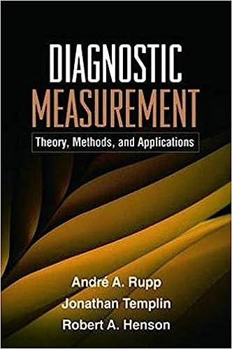
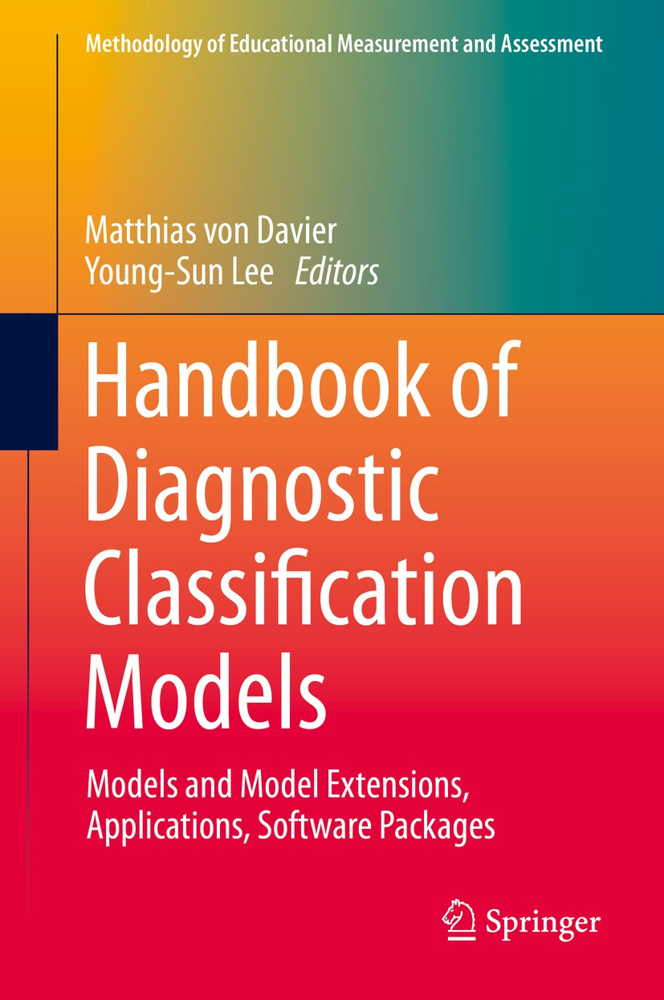
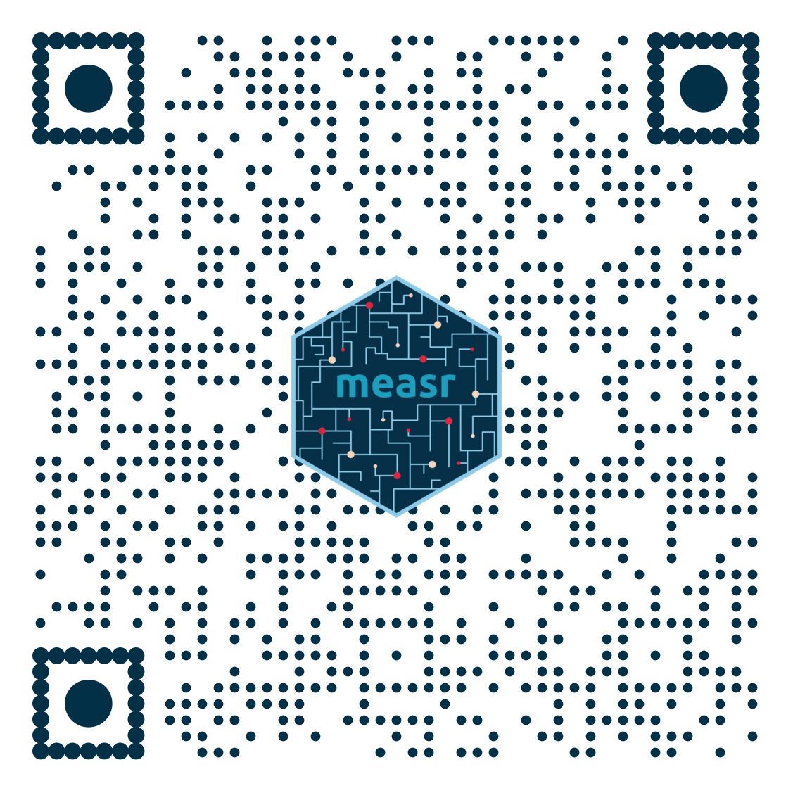
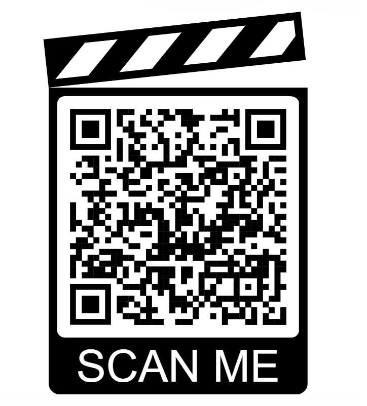

```{r setup, include = FALSE}
library(tidyverse)
library(ggmeasr)
library(ggdist)
library(magick)
library(distributional)
library(knitr)
library(measr)
library(here)
library(fs)
library(downlit)
library(countdown)
library(cmdstanr)
library(posterior)

opts_chunk$set(
  fig.width = 7,
  fig.asp = 0.618,
  fig.align = "center"
)

set_theme(plot_margin = margin(5, 0, 0, 0))
```

# What's next?

## Learn more about DCMs

:::{.columns .center}

:::{.column width="50%"}
[{fig-alt="Cover of Diagnostic Measurement book by Rupp, Templin, and Henson." height="13em"}](https://www.amazon.com/Diagnostic-Measurement-Applications-Methodology-Sciences/dp/1606235273)
:::

:::{.column width="50%"}
[{fig-alt="Cover of the Handbook of Diagnostic Classification Models by von Davier and Lee." height="13em"}](https://link.springer.com/book/10.1007/978-3-030-05584-4)
:::

:::

## Learn more about measr

:::{.columns .v-center-container-slide}

:::{.column .center}
{width="60%" fig-alt="Hex logo for the measr R package."}
:::

:::{.column}

:::{.large .spaced}
 [r-dcm case studies](https://r-dcm.org)

 [measr documentation](https://measr.r-dcm.org)

 [r-dcm/measr](https://github.com/r-dcm/measr)
:::

:::

:::

## Feedback

:::{.columns}

:::{.column .small}
We value your feedback! To answer a short survey about and provide feedback on the {measr} package, please follow this link to a [Qualtrics survey](https://kusurvey.ca1.qualtrics.com/jfe/form/SV_3jGbhNjrU18Y9Se).

ATLAS at the University of Kansas is conducting research to better understand the software development process for {measr}. Individuals who have used the {measr} package and are at least 18 years of age are invited to complete a 5-minute survey on their experiences. For questions, please contact Jake Thompson at [wjakethompson@ku.edu](mailto:wjakethompson@ku.edu).
:::

:::{.column}
[{fig-align="center" fig-alt="QR code to take the workshop survey." height="12em"}](https://kusurvey.ca1.qualtrics.com/jfe/form/SV_3jGbhNjrU18Y9Se)
:::

:::


# <https://learn.r-dcm.org> {.thank-you data-menu-title="Get in touch" background-color="#023047"}

:::{.columns .v-center-container}

:::{.column .image width="60%"}

{width="50%" fig-alt="QR code for the NCME session evaluation."}

:::

:::{.column width="40%"}

:::{.thank-you-subtitle}

:::{.small}

 \ [wjakethompson.com](https://wjakethompson.com)  
 \ [wjakethompson@ku.edu](mailto:wjakethompson@ku.edu)  
 \ [0000-0001-7339-0300](https://orcid.org/0000-0001-7339-0300)  
 \ [in/wjakethompson](https://linkedin.com/in/wjakethompson)  
 \ [@wjakethompson](https://github.com/wjakethompson)  
 \ [@wjakethompson.com](https://bsky.app/profile/wjakethompson.com)  
 \ [@wjakethompson@fosstodon.org](https://fosstodon.org/@wjakethompson)  
 \ [@wjakethompson](https://www.threads.net/@wjakethompson)  
 \ [@wjakethompson](https://twitter.com/wjakethompson)  

:::

:::

:::

:::
