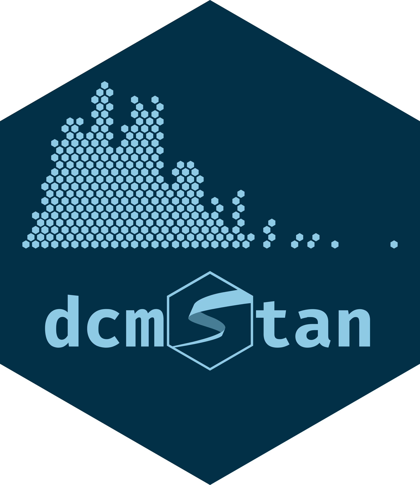
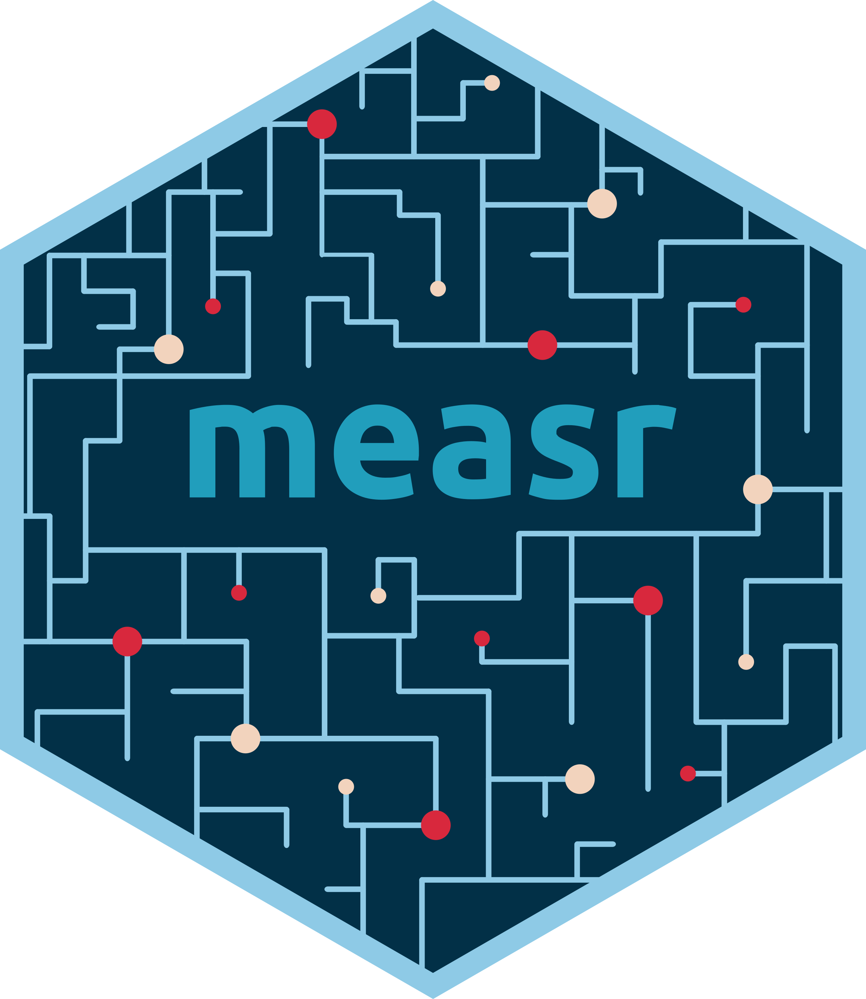

# Welcome!

```{r}
#| label: setup
#| include: false

library(knitr)
library(here)
```

## Who am I?

:::{.columns}
:::{.column width="50%"}
<br>W. Jake Thompson, Ph.D.

* Assistant Director of Psychometrics
  * [ATLAS](https://atlas.ku.edu) | University of Kansas

* Research: Applications of diagnostic psychometric models
  * Lead psychometrician and Co-PI for the [Dynamic Learnings Maps](https://dynamiclearningmaps.org) assessments
  * PI for an [IES-funded](https://ies.ed.gov/funding/grantsearch/details.asp?ID=4546) project to develop software for diagnostic models
:::

:::{.column width="50%"}
:::{.center}


:::{.small}
 &nbsp; [\@](https://www.gitub.com/)  
 &nbsp; [\@](https://bsky.app/profile/)
:::
:::
:::
:::

## Acknowledgements

The research reported here was supported by the Institute of Education Sciences, U.S. Department of Education, through Grants [R305D210045](https://ies.ed.gov/funding/grantsearch/details.asp?ID=4546) and [R305D240032](https://ies.ed.gov/funding/grantsearch/details.asp?ID=6075) to the University of Kansas Center for Research, Inc., ATLAS. The opinions expressed are those of the authors and do not represent the views of the the Institute or the U.S. Department of Education. <br><br>

:::{.columns}
:::{.column width="15%"}
:::

:::{.column width="70%"}

```{r}
#| label: ies-logo
#| echo: false
#| out-width: 100%
#| fig-align: center
#| fig-alt: |
#|   Logo for the Institute of Education Sciences.

include_graphics("figure/IES_InstituteOfEducationSciences_RGB.png")
```

:::

:::{.column width="15%"}
:::
:::

## Schedule

:::{.columns}

:::{.column .center width="50%"}
### Part 1: Foundations

Measurement and structural models

{fig-align="center" width=50%}

:::

:::{.column .center .fragment width="50%"}
### Part 2: Applications

Model misspecifications

{fig-align="center" width=50%}
:::
:::

## Materials

All materials are available on the workshop website:

<https://learn.r-dcm.org>

## Installation

* Required
  * R (≥ 4.5.0)
  * rstan (≥ 2.32.7)
  * measr (≥ 2.0.1)

* Recommended
  * RStudio (≥ 2026.01.1-403)
  * cmdstanr (≥ 0.9.0)
  * CmdStan (≥ 2.38.0)

## Copy and run

```{r}
#| echo: true
#| eval: false

install.packages(c("measr", "tidyverse", "pysch", "here", "fs", "usethis"))


# Optional
install.packages(
  c("rstan", "StanHeaders", "cmdstanr"),
  repos = c("https://stan-dev.r-universe.dev", getOption("repos"))
)

## check toolchain
cmdstanr::check_cmdstan_toolchain()
cmdstanr::install_cmdstan(cores = 2)
```

For help installing RStan, CmdStanR, or configuring the toolchain, see the [prework page](../../materials/prework.qmd).

# DCMs: A quick review

## What are diagnostic models?

:::{.columns}
:::{.column width="50%"}
* DCMs are psychometric models designed to classify
  * There is no scale score
  * We can define our attributes in any way that we choose
  * Items depend on the attribute definitions
  * Classifications are probabilistic
:::

:::{.column .fragment width="50%"}
* DCMs provide valuable information with more feasible data demands than other psychometric models
  * Higher reliability than IRT/MIRT models
  * Complex item structures possible
  * Criterion-referenced interpretations
  * Alignment of assessment goals and psychometric model
:::
:::

## Statistical foundation

* Latent class models use responses to probabilistically place individuals into latent classes

* DCMs are confirmatory latent class models
  * Latent classes specified *a priori* as attribute profiles
  * Q-matrix specifies item-attribute structure
  * Person parameters are attribute proficiency probabilities
  
## Terminology

* **Respondents** (*r*): The individuals from whom behavioral data are collected
  * For today, this is dichotomous assessment item responses
  * Not limited to only item responses in practice

* **Items** (*i*): Assessment questions used to classify/diagnose respondents

* **Attributes** (*a*): Unobserved latent categorical characteristics underlying the behaviors (i.e., diagnostic status)
  * Latent variables

## Attribute profiles

* With binary attributes, there are 2^A^ possible profiles

* Example 3-attribute assessment:

:::{.center .small}
[0, 0, 0]  
[1, 0, 0]  
[0, 1, 0]  
[0, 0, 1]  
[1, 1, 0]  
[1, 0, 1]  
[0, 1, 1]  
[1, 1, 1]
:::

## DCMs as latent class models

$$
\color{#D55E00}{P(X_r=x_r)} = \sum_{c=1}^C\color{#009E73}{\nu_c} \prod_{i=1}^I\color{#56B4E9}{\pi_{ic}^{x_{ir}}(1-\pi_{ic})^{1 - x_{ir}}}
$$

:::{.fragment}
```{=html}
<span class="eqn-box", style="background-color: #D55E00; color: white">Observed data: Probability of observing examinee <em>r</em>'s item reponses</span>
```
:::

:::{.fragment}
```{=html}
<span class="eqn-box", style="background-color: #009E73; color: white">Structural component: Proportion of examinees in each class</span>
```
:::

:::{.fragment}
```{=html}
<span class="eqn-box", style="background-color: #56B4E9; color: white">Measurement component: Product of item response probabilities</span>
```
:::

## Structural models

$$
\color{#D55E00}{P(X_r=x_r)} = \sum_{c=1}^C\color{#009E73}{\nu_c} \prod_{i=1}^I\color{#56B4E9}{\pi_{ic}^{x_{ir}}(1-\pi_{ic})^{1 - x_{ir}}}
$$

```{=html}
<span class="eqn-box", style="background-color: #009E73; color: white; margin-bottom: 0">Structural component: Proportion of examinees in each class</span>
```

* Prevalence of each class in the population
  * &nu;<sub>1</sub> + &nu;<sub>2</sub> + ... + &nu;<sub>c</sub> = 1
* Typically unconstrained
  * Log-linear structural models ([Rupp et al., 2010](https://www.amazon.com/Diagnostic-Measurement-Applications-Methodology-Sciences/dp/1606235273))
  * Hierarchical diagnostic classification model (HDCM; [Templin & Bradshaw, 2014](https://doi.org/10.1007/s11336-013-9362-0))
  * Bayesian network (BayesNet; [Hu & Templin](https://doi.org/10.1080/00273171.2019.1632165))

## Measurement models

$$
\color{#D55E00}{P(X_r=x_r)} = \sum_{c=1}^C\color{#009E73}{\nu_c} \prod_{i=1}^I\color{#56B4E9}{\pi_{ic}^{x_{ir}}(1-\pi_{ic})^{1 - x_{ir}}}
$$

```{=html}
<span class="eqn-box", style="background-color: #56B4E9; color: white; margin-bottom: 0">Measurement component: Product of item response probabilities</span>
```

* Traditional psychometrics: Item response theory, classical test theory
  * A single, unidimensional construct
  * Student results estimated on a continuum
  * Performance on individual items determined by an "item characteristic curve"
* DCMs: Many different options

# Estimation options

## Existing software

<br>

:::{.columns}
:::{.column width="50%"}
:::{.center}
**Software Programs**
:::

* Mplus, flexMIRT, mdltm
* Limitations
  * Tedious to implement, expensive, limited licenses, etc.
:::

:::{.column width="50%"}
:::{.center}
**R Packages**
:::

* CDM, GDINA, mirt, blatant
* Limitations
  * Limited to constrained DCMs, under-documented
  * Different packages have different functionality, and don't talk to each other
:::
:::

## DCMs with Stan

:::{.columns}
:::{.column width="60%"}
* Stan is free and open-source
* Existing documentation for implementing DCMs
  * [Case study using the DINA model](https://mc-stan.org/learn-stan/case-studies/dina_independent.html)
  * [Paper describing LCDM implmentation](https://doi.org/10.3758/s13428-018-1069-9)
* Access to other packages in the Stan ecosystem
  * [loo](https://mc-stan.org/loo/)
  * [tidybayes](http://mjskay.github.io/tidybayes/)
  * [posterior](https://mc-stan.org/posterior/)
:::

:::{.column width="40%"}
:::{.center}
{fig-alt="Stan logo."}
:::
:::
:::

## Limitations of Stan for DCMs

* Very tedious---prone to typos
* Complexity increases with the number of attributes and item structure
* Stan code must be customized to each particular Q-matrix

* Just need to automate the creation of the Stan scripts...


# {.empty data-menu-title="measr" background-color="#023047" background-iframe="grid-worms/index.html"}

```{r}
#| label: big-image
#| out-width: 100%
#| fig-alt: "Hex logo for the measr R package."

include_graphics(here("materials", "slides", "figure", "measr.png"))
```

## What is measr?

* R package that automates the creation of Stan scripts for DCMs
* Wraps [rstan](https://mc-stan.org/rstan) or [cmdstanr](https://mc-stan.org/cmdstanr) to estimate the models
* Provides additional functions to automate the evaluation of DCMs
  * Model fit
  * Classification accuracy and consistency

## The rest of today

* Measurement models with [dcmstan](https://dcmstan.r-dcm.org) and [measr](https://measr.r-dcm.org)

* Structural models with [dcmstan](https://dcmstan.r-dcm.org) and [measr](https://measr.r-dcm.org)

* Model misspecifications with [measr](https://measr.r-dcm.org)

# {.closing data-menu-title="Closing"}

<br>

:::{.end-title color="white" font-size="200%"}
Diagnostic classification models
:::

:::{.end-subtitle}
A quick review
:::

:::{.center}
<https://learn.r-dcm.org>
:::
