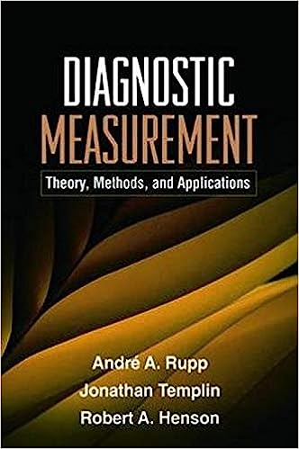
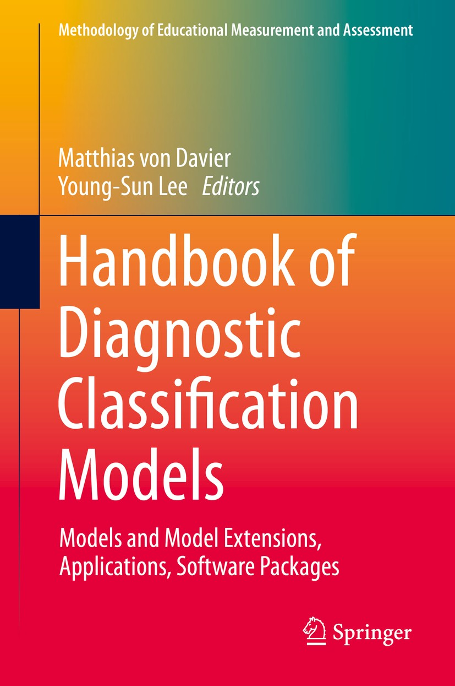
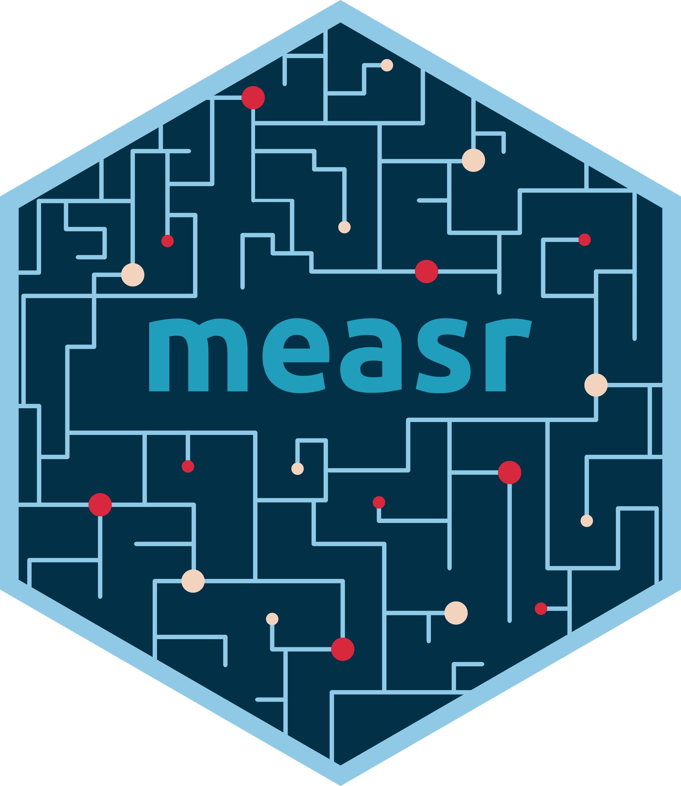
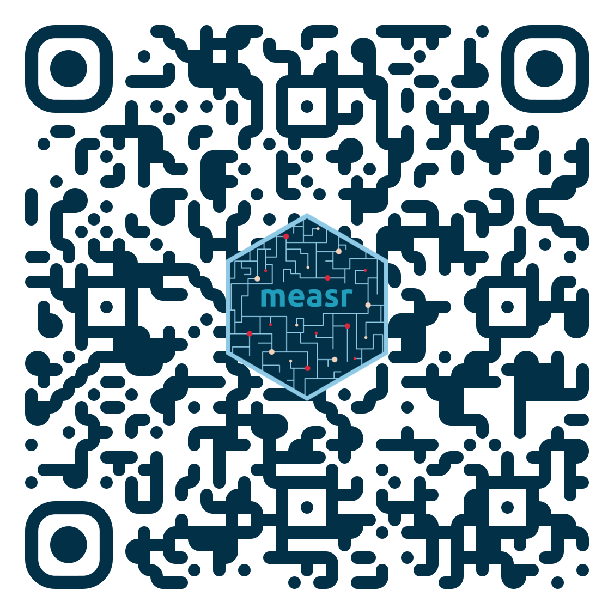

# Welcome!

```{r}
#| label: setup
#| include: false
library(tidyverse)
library(ggmeasr)
library(ggdist)
library(magick)
library(distributional)
library(knitr)
library(measr)
library(here)
library(fs)
library(downlit)
library(countdown)
library(cmdstanr)
library(gt)
library(dcmdata)

set_theme(plot_margin = margin(5, 0, 0, 0))

msr_colors <- c("#8ECAE6", "#023047", "#D7263D")

# copy grid-worms --------------------------------------------------------------
if (!dir_exists(here("_site/materials/slides/"))) {
  dir_create(here("_site/materials/slides/"))
}
dir_copy(
  here("materials", "slides", "grid-worms"),
  here("_site/materials/slides/grid-worms"),
  overwrite = TRUE
)

# gt theme ---------------------------------------------------------------------
gt_theme_rdcm <- function(gt_dat, bg_color = "#FFFFFF", ...) {
  gt_dat |>
    gt::opt_all_caps() |>
    gt::opt_table_font(
      font = list(gt::google_font("Open Sans"), gt::default_fonts())
    ) |>
    gt::tab_options(
      column_labels.background.color = bg_color,
      column_labels.border.top.width = gt::px(3),
      column_labels.border.top.color = bg_color,
      table.border.top.width = gt::px(1),
      table.border.bottom.width = gt::px(1),
      heading.align = "left",
      heading.background.color = bg_color,
      source_notes.padding = gt::px(10),
      source_notes.border.lr.width = gt::px(0),
      source_notes.font.size = 12,
      source_notes.background.color = bg_color,
      table.font.size = 16,
      data_row.padding = gt::px(3),
      table.background.color = bg_color,
      ...
    ) |>
    gt::tab_style(
      style = gt::cell_borders(
        sides = "bottom",
        color = "transparent",
        weight = gt::px(2)
      ),
      locations = gt::cells_body(
        columns = gt::everything(),
        rows = nrow(gt_dat$`_data`)
      )
    ) |>
    gt::tab_style(
      style = list(
        gt::cell_text(
          weight = "bold",
          align = "center",
          v_align = "middle",
          color = msr_colors[2]
        ),
        gt::cell_borders(
          sides = "bottom",
          color = msr_colors[2],
          weight = gt::px(3)
        )
      ),
      locations = gt::cells_column_labels(gt::everything())
    ) |>
    gt::tab_style(
      style = gt::cell_fill(color = bg_color),
      locations = list(gt::cells_body(
        columns = gt::everything(),
        rows = gt::everything()
      ))
    )
}
```

## Who am I?

:::{.columns}
:::{.column width="50%"}
<br>W. Jake Thompson, Ph.D.

* Assistant Director of Psychometrics
  * [ATLAS](https://atlas.ku.edu) | University of Kansas

* Research: Applications of diagnostic psychometric models
  * Lead psychometrician and Co-PI for the [Dynamic Learnings Maps](https://dynamiclearningmaps.org) assessments
  * PI for an [IES-funded](https://ies.ed.gov/funding/grantsearch/details.asp?ID=4546) project to develop software for diagnostic models
:::

:::{.column width="50%"}
:::{.center}


:::{.small}
 &nbsp; [\@](https://www.gitub.com/)  
 &nbsp; [\@](https://bsky.app/profile/)
:::
:::
:::
:::

## Materials

All materials are available on the workshop website:

<https://learn.r-dcm.org>

## Installation

* Required
  * R (≥ 4.5.0)
  * rstan (≥ 2.32.7)
  * measr (≥ 2.0.1)

* Recommended
  * RStudio (≥ 2026.01.1-403)
  * cmdstanr (≥ 0.9.0)
  * CmdStan (≥ 2.38.0)

## Copy and run

```{r}
#| echo: true
#| eval: false
install.packages(c("measr", "tidyverse", "here", "fs", "usethis"))

# Optional
install.packages(
  c("rstan", "StanHeaders", "cmdstanr"),
  repos = c("https://stan-dev.r-universe.dev", getOption("repos"))
)

## check toolchain
cmdstanr::check_cmdstan_toolchain()
cmdstanr::install_cmdstan(cores = 2)
```

For help installing RStan, CmdStanR, or configuring the toolchain, see the prework page (<https://learn.r-dcm.org/materials/prework>).

# Diagnostic assessments

## {data-menu-title="Our Example"}

```{r}
#| label: taylor-grammys
#| out-width: 100%
#| fit-alt: "Artistic renderings of Taylor Swift after her Grammy wins."
include_graphics(here(
  "materials",
  "slides",
  "figure",
  "taylor",
  "taylor-grammys.png"
))
```

## {data-menu-title="Taylor's Eras" .empty-white}

```{r}
#| label: all-taylor
#| out-width: 100%
#| fit-alt: "Artistic renderings of Taylor Swift from all 13 album releases."
include_graphics(here(
  "materials",
  "slides",
  "figure",
  "taylor",
  "all-taylor.png"
))
```

## {data-menu-title="Classic psychometrics"}

:::{.columns}
:::{.column width="25%"}
* Traditional assessments and psychometric models measure an overall skill or ability
* Assume a continuous latent trait
:::

:::{.column width="75%"}
```{r}
#| label: taylor-continuum
#| out-width: 100%
#| out-height: 90%
#| fig-alt: |
#|   A normal distribution with images of Taylor Swift from each era overlayed.
taylors <- read_rds(here(
  "materials",
  "slides",
  "data",
  "taylor-results.rds"
)) |>
  mutate(
    x = theta,
    y = 0.02,
    img = here("materials", "slides", "figure", "taylor", "eras", img)
  )

base <- prior(normal(0, 1), type = "intercept") |>
  dcmstan::prior_tibble() |>
  parse_dist(prior) |>
  ggplot(aes(xdist = .dist_obj)) +
  stat_slab(color = palette_measr[1], fill = palette_measr[3])

width <- 0.6
for (i in 1:nrow(taylors)) {
  img <- as.raster(image_read(taylors$img[i]))

  base <- base +
    annotation_raster(
      img,
      taylors$x[i] - (width / 2),
      taylors$x[i] + (width / 2),
      taylors$y[i],
      taylors$y[i] + 0.25
    )
}

base +
  labs(x = "Musical Knowledge", y = NULL) +
  theme(axis.text.y = element_blank(), axis.title.y = element_blank())
```

:::
:::

## {data-menu-title="Traditional measurement: Weak ordering"}

:::{.columns}
:::{.column width="25%"}
* The output is a weak ordering due to error in estimates
  * Confident *Taylor Swift* (debut) is the worst
  * Not confident on ordering toward the middle of the distribution
:::

:::{.column width="75%"}
```{r}
#| label: taylor-continuum
#| out-width: 100%
#| out-height: 90%
#| fig-alt: |
#|   A normal distribution with images of Taylor Swift from each era overlayed.
```

:::
:::

## {data-menu-title="Traditional measurement: Student feedback"}

:::{.columns}
:::{.column width="25%"}
* Limited in the types of questions that can be answered. 
  * Why is *Taylor Swift* (debut) so low?
  * What aspects do each era demonstrate proficiency or competency of?
  * How much skill is "enough" to be competent?
:::

:::{.column width="75%"}
```{r}
#| label: taylor-continuum
#| out-width: 100%
#| out-height: 90%
#| fig-alt: |
#|   A normal distribution with images of Taylor Swift from each era overlayed.
```

:::
:::
  
## Diagnostic measurement

* Designed to be multidimensional
* No continuum of student achievement
* Categorical constructs
  * Usually binary (e.g., master/nonmaster, proficient/not proficient)

* Several different names in the literature
  * Diagnostic classification models (DCMs)
  * Cognitive diagnostic models (CDMs)
  * Skills assessment models
  * Latent response models
  * Restricted latent class models

## Diagnostic music assessment

:::{.columns}

:::{.column width="30%"}
* Rather than measuring overall musical knowledge, we can break music down into set of skills or *attributes*
  * Songwriting
  * Production
  * Vocals
:::

:::{.column width="70%"}
```{r}
#| label: music-attributes
#| fig-asp: 0.3
#| out-width: 80%
#| out-height: 40%
#| fig-alt: |
#|   Three circles representing the 3 attributes. The bottom half of each circle
#|   is shaded dark, and the top half is light, to indicate there are two
#|   categories for each attribute.
library(ggforce)

tibble(
  start = rep(c(-pi / 2, pi / 2), 3),
  type = rep(c("Proficient", "Non-proficient"), 3),
  skill = rep(c("Songwriting", "Production", "Vocals"), each = 2),
  x = rep(c(3, 6, 9), each = 2),
  y = 0
) |>
  ggplot() +
  geom_arc_bar(
    aes(
      x0 = x,
      y0 = y,
      r0 = 0,
      r = 1.2,
      start = start,
      end = start + pi,
      fill = type
    ),
    color = "white",
    show.legend = FALSE,
    radius = 0
  ) +
  geom_text(
    data = ~ slice(., c(1, 3, 5, 7)),
    aes(x = x, y = 0.2, label = skill),
    size = 5
  ) +
  scale_fill_manual(
    values = c(
      "Proficient" = palette_measr[3],
      "Non-proficient" = palette_measr[1]
    )
  ) +
  coord_equal() +
  theme_void()
```

:::
:::

* Attributes are categorical, often dichotomous (e.g., proficient vs. non-proficient)

## Diagnostic classification models

:::{.columns}
:::{.column width="50%"}
* DCMs place individuals into groups according to proficiency of multiple attributes
* Students are probabilistically placed into classes
  * Classes are represented by skill profiles
* Feedback on specific skills as defined by the cognitive theory and test design
* No scale, no overall "ability"
:::

:::{.column width="50%"}
```{r}
#| label: taylor-profiles
library(gt)
library(gtExtras)

taylor_profiles <- taylors |>
  mutate(across(c(songwriting, production, vocals), \(x) {
    case_when(x == 1 ~ "check", x == 0 ~ "xmark")
  })) |>
  mutate(
    s_color = case_when(
      songwriting == "xmark" ~ palette_measr[2],
      songwriting == "check" ~ palette_measr[4]
    ),
    p_color = case_when(
      production == "xmark" ~ palette_measr[2],
      production == "check" ~ palette_measr[4]
    ),
    v_color = case_when(
      vocals == "xmark" ~ palette_measr[2],
      vocals == "check" ~ palette_measr[4]
    )
  ) |>
  select(
    era,
    album_release,
    img,
    songwriting,
    production,
    vocals,
    ends_with("_color")
  )

taylor_profiles |>
  filter(era %in% c("Debut", "1989", "reputation", "folklore")) |>
  select(img, songwriting, production, vocals, ends_with("_color")) |>
  gt() |>
  cols_hide(ends_with("_color")) |>
  cols_label(img = "") |>
  # cols_width(img ~ px(100),
  #            everything() ~ px(150)) |>
  gt_img_rows(columns = img, img_source = "local", height = 75) |>
  fmt_icon(songwriting, fill_color = from_column("s_color"), height = "40px") |>
  fmt_icon(production, fill_color = from_column("p_color"), height = "40px") |>
  fmt_icon(vocals, fill_color = from_column("v_color"), height = "40px") |>
  cols_align("center", -img) |>
  gt_theme_measr() |>
  tab_options(table.font.size = 24)
```

:::
:::

## Benefits of DCMs

:::{.columns}
:::{.column width="50%"}
* Fine-grained, multidimensional results. Answer more questions:
  * Why is *Taylor Swift* (debut) so low?
    * Subpar songwriting, production, and vocals
  * What aspects are albums competent/proficient in?
    * DCMs provide classifications directly

* High reliability with fewer items
  * Less information need to classify than to place precisely along a scale
:::

:::{.column width="50%"}
```{r}
#| label: taylor-profiles
```

:::
:::

## Fine-grained feedback

* Distinguish between respondents who may have similar scale scores

:::{.columns}
:::{.column width="50%"}
```{r}
#| label: mid-profiles
taylor_profiles |>
  semi_join(
    taylors |>
      filter(between(theta, -0.5, 0.5)),
    join_by(era)
  ) |>
  select(img, songwriting, production, vocals, ends_with("_color")) |>
  gt() |>
  cols_hide(ends_with("_color")) |>
  cols_label(img = "") |>
  # cols_width(img ~ px(100),
  #            everything() ~ px(150)) |>
  gt_img_rows(columns = img, img_source = "local", height = 75) |>
  fmt_icon(songwriting, fill_color = from_column("s_color"), height = "40px") |>
  fmt_icon(production, fill_color = from_column("p_color"), height = "40px") |>
  fmt_icon(vocals, fill_color = from_column("v_color"), height = "40px") |>
  cols_align("center", -img) |>
  gt_theme_measr() |>
  tab_options(
    table.font.size = 18,
    container.height = px(400),
    container.overflow.y = TRUE
  )
```

:::

:::{.column width="50%"}
```{r}
#| label: mid-scale
table_taylors <- taylors |>
  filter(between(theta, -0.5, 0.5))

prior(normal(0, 1), type = "intercept") |>
  dcmstan::prior_tibble() |>
  parse_dist(prior) |>
  ggplot(aes(xdist = .dist_obj)) +
  stat_slab(color = palette_measr[1], fill = palette_measr[3]) -> base

width <- 0.6
for (i in 1:nrow(table_taylors)) {
  img <- as.raster(image_read(table_taylors$img[i]))

  base <- base +
    annotation_raster(
      img,
      table_taylors$x[i] - (width / 2),
      table_taylors$x[i] + (width / 2),
      table_taylors$y[i],
      table_taylors$y[i] + 0.25
    )
}

base +
  labs(x = "Musical Knowledge", y = NULL) +
  theme(axis.text.y = element_blank(), axis.title.y = element_blank())
```

:::
:::

## When are DCMs appropriate?

Success depends on:

1. Domain definitions
    * What are the attributes we're trying to measure?
    * Are the attributes measurable (e.g., with assessment items)?
  
2. Alignment of purpose between assessment and model
    * Is classification the purpose?

## Example applications

* **Educational measurement:** The competencies that student is or is not proficient in
  * Latent knowledge, skills, or understandings
  * Used for tailored instruction and remediation
  
* **Psychiatric assessment:** The DSM criteria that an individual meets
  * Broader diagnosis of a disorder

## When are DCMs not appropriate?

* When the goal is to place individuals on a scale

* DCMs do not distinguish within classes

:::{.columns}
:::{.column width="50%"}
<br>

```{r}
#| label: red-profiles
taylor_profiles |>
  filter(str_detect(era, "Red")) |>
  select(img, songwriting, production, vocals, ends_with("_color")) |>
  gt() |>
  cols_hide(ends_with("_color")) |>
  cols_label(img = "") |>
  # cols_width(img ~ px(100),
  #            everything() ~ px(150)) |>
  gt_img_rows(columns = img, img_source = "local", height = 75) |>
  fmt_icon(songwriting, fill_color = from_column("s_color"), height = "40px") |>
  fmt_icon(production, fill_color = from_column("p_color"), height = "40px") |>
  fmt_icon(vocals, fill_color = from_column("v_color"), height = "40px") |>
  cols_align("center", -img) |>
  gt_theme_measr() |>
  tab_options(table.font.size = 18)
```

:::

:::{.column width="50%"}
```{r}
#| label: red-scale
table_taylors <- taylors |>
  filter(str_detect(era, "Red"))

prior(normal(0, 1), type = "intercept") |>
  dcmstan::prior_tibble() |>
  parse_dist(prior) |>
  ggplot(aes(xdist = .dist_obj)) +
  stat_slab(color = palette_measr[1], fill = palette_measr[3]) -> base

width <- 0.6
for (i in 1:nrow(table_taylors)) {
  img <- as.raster(image_read(table_taylors$img[i]))

  base <- base +
    annotation_raster(
      img,
      table_taylors$x[i] - (width / 2),
      table_taylors$x[i] + (width / 2),
      table_taylors$y[i],
      table_taylors$y[i] + 0.25
    )
}

base +
  labs(x = "Musical Knowledge", y = NULL) +
  theme(axis.text.y = element_blank(), axis.title.y = element_blank())
```

:::
:::

# Using diagnostic models

## {.empty data-menu-title="measr" background-color="#023047" background-iframe="grid-worms/index.html"}

```{r}
#| label: big-image
#| out-width: 100%
#| fig-alt: "Hex logo for the measr R package."
include_graphics(here("materials", "slides", "figure", "measr.png"))
```

## What is measr?

* R package that automates the creation of Stan scripts for DCMs
* Wraps [rstan](https://mc-stan.org/rstan) or [cmdstanr](https://mc-stan.org/cmdstanr) to estimate the models
* Provides additional functions to automate the evaluation of DCMs
  * Model fit
  * Classification accuracy and consistency

## Data for examples

* Examination for the certificate of proficiency in English (ECPE; [Templin & Hoffman, 2013](https://doi.org/10.1111/emip.12010))
  * 28 items measuring 3 total attributes
  * 2,922 respondents

* 3 attributes
  * Morphosyntactic rules
  * Cohesive rules
  * Lexical rules

## ECPE data

```{r}
#| label: ecpe-data
#| echo: true
library(dcmdata)

ecpe_data
```

## ECPE Q-matrix

```{r}
#| label: ecpe-qmatrix
#| echo: true
#| code-line-numbers: "|5|6,12|7,11"
ecpe_qmatrix
```

## Data for exercises {.exercise}

* Rapid online assessment of reading and phonological awareness (ROAR-PA; [Gijbels et al., 2024](https://doi.org/10.1038/s41598-024-60834-9))

## Exercise 1 {.exercise}

1. Download the exercise files
```{r}
#| label: download-materials
#| echo: true
#| eval: false
usethis::use_course("r-dcm/pce2026-exercises")
```

2. Open `exercises.Rmd`

3. Run the `setup` chunk

4. Explore the ROAR-PA data and Q-matrix
    * How many items are in the data?
    * How many respondents are in the data? 
    * How many attributes are measured?
    


## {.exercise data-menu-title="Solution 1"}

```{r}
#| label: modify-roarpa
roarpa_data <- roarpa_data |>
  filter(complete.cases(roarpa_data))
```

::: {.panel-tabset}

### ROAR-PA data

:::{.columns}

:::{.column width="60%"}
```{r}
#| label: roarpa-data
#| echo: true
roarpa_data
```

:::

:::{.column width="40%"}

* 57 items
* 222 respondents

:::

:::

### ROAR-PA Q-matrix

:::{.columns}

:::{.column width="60%"}
```{r}
#| label: roarpa-qmatrix
#| echo: true
roarpa_qmatrix
```

:::

:::{.column width="40%"}

* 57 items
* 3 attributes
  * First sound matching (`fsm`)
  * Last sound matching (`lsm`)
  * Deletion (`del`)

:::

:::

:::


## Model specification

Specify a DCM with `dcm_specify()`<br><br>

```{r}
#| label: specify-ecpe
#| echo: true
ecpe_spec <- dcm_specify(
  qmatrix = ecpe_qmatrix, # <1>
  identifier = "item_id", # <1>
  measurement_model = lcdm(), # <2>
  structural_model = unconstrained() # <2>
)
```

1. Specify your Q-matrix, and ID column (if present)
2. Choose the measurement and structural model to estimate

## Exercise 2 {.exercise}

* Create a model specification for the ROAR-PA data

* Use `lcdm()` for the measurement model and `unconstrained()` for the structural model
    


## {.exercise data-menu-title="Solution 2"}

```{r}
#| label: specify-roarpa
#| echo: true
roarpa_spec <- dcm_specify(
  qmatrix = roarpa_qmatrix,
  identifier = "item",
  measurement_model = lcdm(),
  structural_model = unconstrained()
)
```

## Model estimation

Estimate a DCM with `dcm_estimate()`<br><br>

```{r}
#| label: estimate-ecpe
#| echo: true
ecpe_lcdm <- dcm_estimate(
  dcm_spec = ecpe_spec, # <1>
  data = ecpe_data, # <2>
  identifier = "resp_id", # <2>
  method = "pathfinder", # <3>
  backend = "cmdstanr", # <3>
  single_path_draws = 1000, # <4>
  num_paths = 10, # <4>
  draws = 2000, # <4>
  file = here("materials", "slides", "fits", "ecpe-lcdm-uncst") # <5>
)
```

1. Define your model specification
2. Specify your data and ID column (if present)
3. Choose your estimation method and backend
4. Pass additional arguments to the backend
5. Save the model for future efficiency


## `dcm_estimate()` options

* `method`: How to estimate the model
  * Full posterior sampling with "mcmc"
  * Quicker, but more limited "optim"
  * Posterior approximation with "variational" (default) or "pathfinder"
    * Variational inference does not always converge
    * Pathfinder is only available for the cmdstanr backend

* `...`: Additional arguments that are passed to, depending on the `method` and `backend`

:::{.columns}
:::{.column width="50%"}
* 
  * `r autolink("rstan::sampling()")`
  * `r autolink("rstan::optimizing()")`
  * `r autolink("rstan::vb()")`
:::

:::{.column width="50%"}
*
  * `r autolink("cmdstanr::sample()")`
  * `r autolink("cmdstanr::optimize()")`
  * `r autolink("cmdstanr::variational()")`
  * `r autolink("cmdstanr::pathfinder()")`
:::

:::  

## Exercise 3 {.exercise}

* Estimate an LCDM on the ROAR-PA data using variational inference.
  * Use rstan for the backend
  * Use seed: `19891213`



## {.exercise data-menu-title="Solution 3"}

```{r}
#| label: roarpa-model
#| echo: true
roarpa_lcdm <- dcm_estimate(
  roarpa_spec,
  data = roarpa_data,
  identifier = "id",
  method = "variational",
  backend = "rstan",
  seed = 19891213,
  file = here("materials", "slides", "fits", "roarpa-lcdm-uncst")
)
```

## Extracting structural parameters

```{r}
#| label: ecpe-strc
#| echo: true
#| code-line-numbers: "|5,8,11,12"
measr_extract(ecpe_lcdm, "strc_param")
```

## Extracting respondent probabilities

```{r}
#| label: add-ecpe-prob
ecpe_lcdm <- add_respondent_estimates(ecpe_lcdm)
```

```{r}
#| label: ecpe-prob
#| echo: true
measr_extract(ecpe_lcdm, "attribute_prob")
```

## Exercise 4 {.exercise}

* What proportion of respondents have mastered both first and last sound matching in the ROAR-PA data?

* What is the probability that respondent 153 has mastered deletion?



## {.exercise data-menu-title="Solution 4"}

:::{.panel-tabset}

### Structural parameters

```{r}
#| label: roarpa-strc
#| echo: true
#| code-line-numbers: "|10,12|20"
measr_extract(roarpa_lcdm, "strc_param")

measr_extract(roarpa_lcdm, "strc_param") |>
  filter(fsm == 1, lsm == 1) |>
  summarize(estimate = rvar_sum(estimate))
```


### Respondent probabilities

```{r}
#| label: add-roarpa-prob
roarpa_lcdm <- add_respondent_estimates(roarpa_lcdm)
```

```{r}
#| label: roarpa-prob
#| echo: true
measr_extract(roarpa_lcdm, "attribute_prob") |>
  filter(id == 153)
```

:::

# What's next?

## Learn more about DCMs

:::{.columns .center}

:::{.column width="50%"}
[{fig-alt="Cover of Diagnostic Measurement book by Rupp, Templin, and Henson." height="13em"}](https://www.amazon.com/Diagnostic-Measurement-Applications-Methodology-Sciences/dp/1606235273)
:::

:::{.column width="50%"}
[{fig-alt="Cover of the Handbook of Diagnostic Classification Models by von Davier and Lee." height="13em"}](https://link.springer.com/book/10.1007/978-3-030-05584-4)
:::

:::

## Learn more about measr

:::{.columns .v-center-container-slide}

:::{.column .center}
{width="60%" fig-alt="Hex logo for the measr R package."}
:::

:::{.column}

:::{.large .spaced}
 [r-dcm case studies](https://r-dcm.org)

 [measr documentation](https://measr.r-dcm.org)

 [r-dcm/measr](https://github.com/r-dcm/measr)
:::

:::

:::

## Feedback

:::{.columns}

:::{.column .small}
We value your feedback! To answer a short survey about and provide feedback on the {measr} package, please follow this link to a [Qualtrics survey](https://kusurvey.ca1.qualtrics.com/jfe/form/SV_3jGbhNjrU18Y9Se).

ATLAS at the University of Kansas is conducting research to better understand the software development process for {measr}. Individuals who have used the {measr} package and are at least 18 years of age are invited to complete a 5-minute survey on their experiences. For questions, please contact Jake Thompson at [wjakethompson@ku.edu](mailto:wjakethompson@ku.edu).
:::

:::{.column}
[{fig-align="center" fig-alt="QR code to take the workshop survey." height="12em"}](https://kusurvey.ca1.qualtrics.com/jfe/form/SV_3jGbhNjrU18Y9Se)
:::

:::

# <https://learn.r-dcm.org> {.thank-you data-menu-title="Get in touch" background-color="#023047"}

:::{.columns .v-center-container}

:::{.column .image width="60%"}

```{r}
#| label: big-image
#| out-width: 50%
```

:::

:::{.column width="40%"}

:::{.thank-you-subtitle}

:::{.small}

 \ [wjakethompson.com](https://wjakethompson.com)  
 \ [wjakethompson@ku.edu](mailto:wjakethompson@ku.edu)  
 \ [0000-0001-7339-0300](https://orcid.org/0000-0001-7339-0300)  
 \ [in/wjakethompson](https://linkedin.com/in/wjakethompson)  
 \ [@wjakethompson](https://github.com/wjakethompson)  
 \ [@wjakethompson.com](https://bsky.app/profile/wjakethompson.com)  
 \ [@wjakethompson@fosstodon.org](https://fosstodon.org/@wjakethompson)  
 \ [@wjakethompson](https://www.threads.net/@wjakethompson)  
 \ [@wjakethompson](https://twitter.com/wjakethompson)  

:::

:::

:::

:::


## Acknowledgements

The research reported here was supported by the Institute of Education Sciences, U.S. Department of Education, through Grants [R305D210045](https://ies.ed.gov/funding/grantsearch/details.asp?ID=4546) and [R305D240032](https://ies.ed.gov/funding/grantsearch/details.asp?ID=6075) to the University of Kansas Center for Research, Inc., ATLAS. The opinions expressed are those of the authors and do not represent the views of the the Institute or the U.S. Department of Education. <br><br>

:::{.columns}
:::{.column width="15%"}
:::

:::{.column width="70%"}

```{r}
#| label: ies-logo
#| echo: false
#| out-width: 100%
#| fig-align: center
#| fig-alt: |
#|   Logo for the Institute of Education Sciences.
include_graphics("figure/IES_InstituteOfEducationSciences_RGB.png")
```

:::

:::{.column width="15%"}
:::
:::
